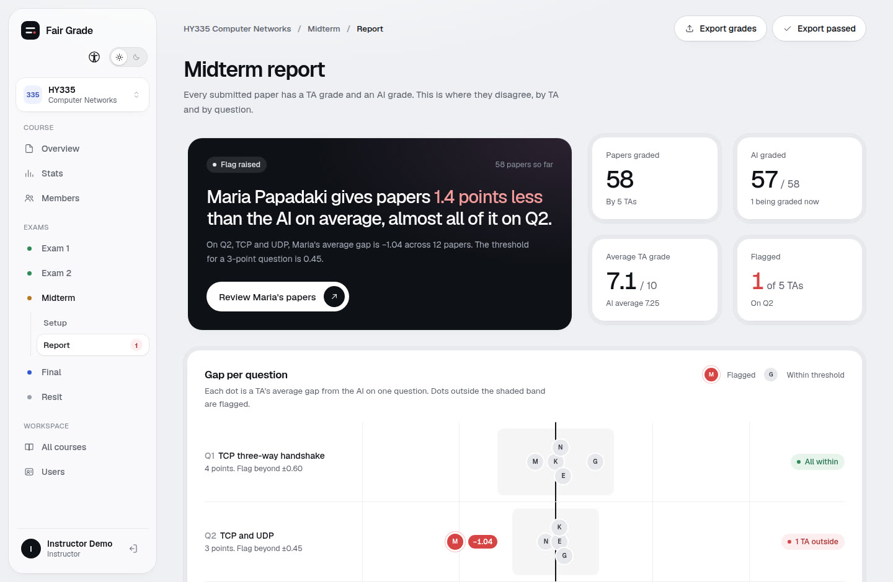
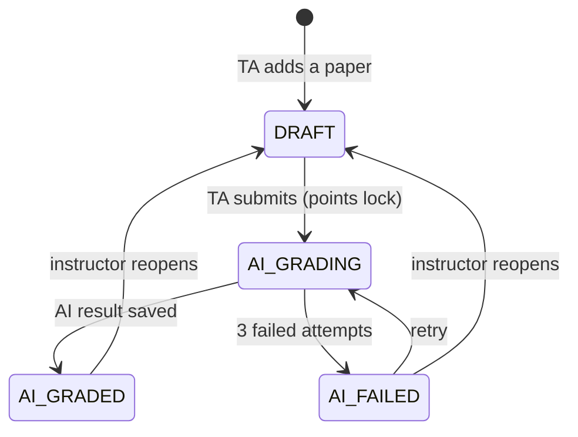
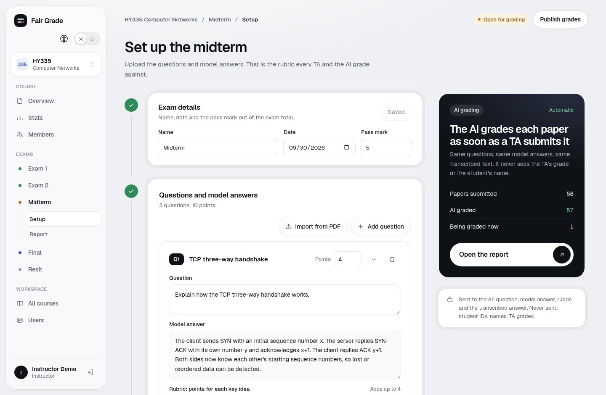
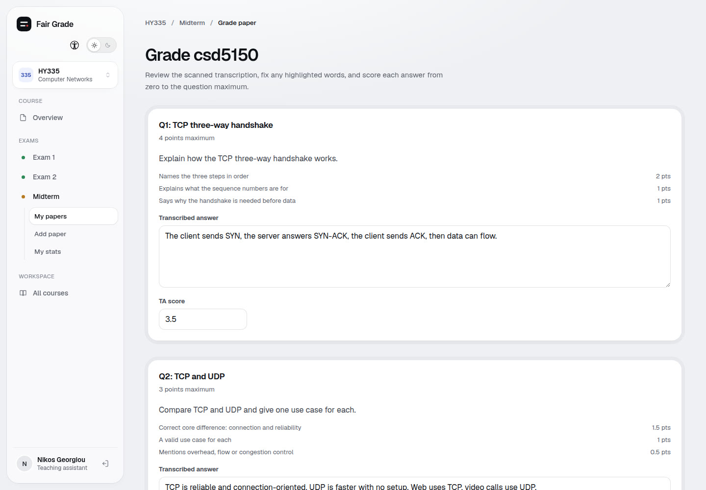
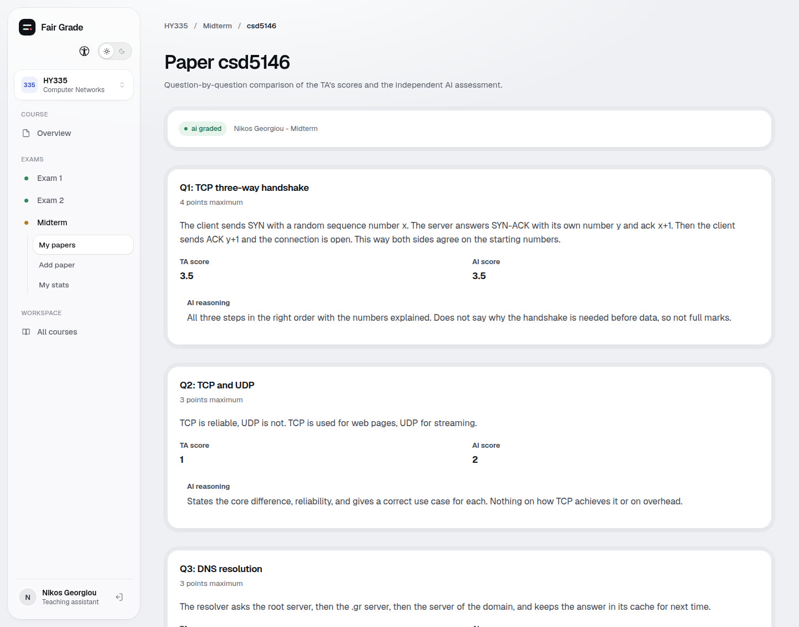
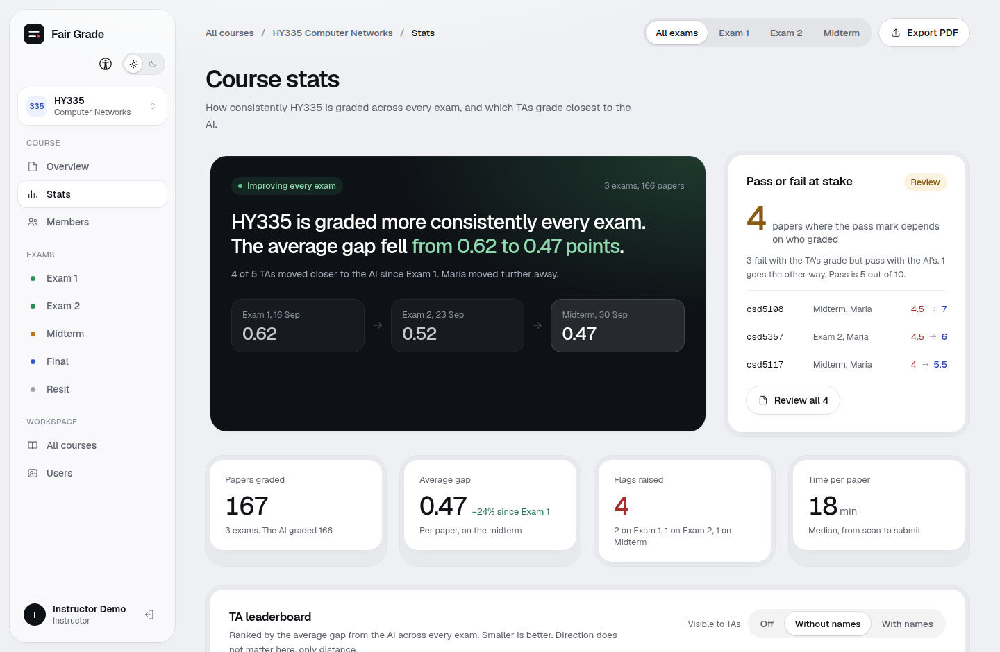
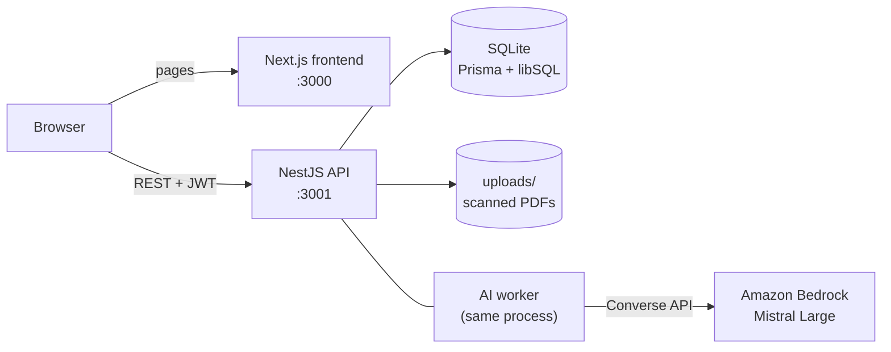

# Fair Grade

**Consistent grading across every TA, with an AI second opinion.**

When several teaching assistants (TAs) grade the same exam, identical answers can get different scores depending on who marks them. Fair Grade grades the *same transcribed answers* with an AI against the *same model answers and rubric*, then shows the instructor where each TA and the AI disagree, per TA and per question, before grades go out.

The AI is a second opinion, not the grader: humans stay in charge.



## Contents

- [How it works](#how-it-works)
- [Features](#features)
- [Roles and access rules](#roles-and-access-rules)
- [Architecture](#architecture)
- [Getting started](#getting-started)
- [Configuration](#configuration)
- [Running in production](#running-in-production)
- [Security](#security)
- [API](#api)
- [Testing and CI](#testing-and-ci)
- [Project layout](#project-layout)
- [Known limitations](#known-limitations)

## How it works

1. The **instructor** creates a course, adds the **TAs** as members, and sets up each exam: the questions, a model answer for each, and rubric points that add up to the question's maximum.
2. A **TA** adds a paper (one student, a scanned PDF). The answers are transcribed; the TA checks the text and scores each question.
3. The TA **submits**, which locks their points.
4. The **AI grades the same transcribed answers** in the background. It receives only the question, its maximum points, the model answer, the rubric and the answer text. **Never** student IDs, names or the TA's points.
5. The TA now sees TA vs AI per question, with the AI's reasoning. Before submitting they never see the AI's grade.
6. The instructor sees the **report**. A TA is **flagged** on a question when they have at least 3 papers on it and their average gap from the AI is more than 15% of the question's points. The instructor opens the papers behind the flag, reads the AI's reasoning, and **reopens** the ones to regrade before publishing grades.



A paper starts in `TRANSCRIBING` instead of `DRAFT` once a real handwriting transcriber is plugged in (see [Known limitations](#known-limitations)). An exam moves `DRAFT → QUESTIONS_READY → OPEN → PUBLISHED`, and TAs can add papers only while it is `OPEN`.

| Instructor sets the standard | TA grades a paper | TA sees TA vs AI |
|---|---|---|
|  |  |  |



## Features

- **Courses, members, exams, questions.** Model answers and rubric points per question, checked to add up to the maximum.
- **Paper workflow.** Upload a scanned PDF, review the transcription, save a draft, submit. Submitting locks the TA's points.
- **Background AI grading** with retries, backoff and a clear failed state the TA can retry.
- **Exam report** (instructor): the flag, gap per question per TA, a TA table, largest gaps, and **who passed** by the TA's grade versus the AI's (pass mark per exam). CSV export of all grades and of passed students.
- **TA page** (instructor): one TA against the AI, with the papers behind the flag.
- **Course stats** (instructor): trend across exams, TA leaderboard (off, anonymous or named, visible to TAs per the instructor's choice), pass/fail at stake, grade distribution, rubrics worth tightening, live activity feed.
- **TA stats**: TA vs AI on their own papers, and the papers worth a second look.
- **Reopen flow.** A TA can ask to reopen a submitted paper; only the instructor reopens or declines. Points before a reopen are kept as a revision.
- **User management.** The instructor creates TA accounts (a temporary password is shown once) and can deactivate users.
- **Light and dark theme** and an accessibility panel (text size, bold text, high contrast, extra spacing, reduced motion).

## Roles and access rules

| Role | Can |
|---|---|
| **Instructor** | Sign up themselves. Create courses and exams, manage members and TA accounts, see reports and stats, reopen papers, publish an exam. Sees only the courses they own. |
| **TA** | Add and grade papers in the courses they are a member of; see their own papers and stats; ask to reopen a submitted paper. A TA cannot sign up: the instructor creates the account. |

These rules are enforced **in the backend**, never only in the UI:

- Course membership is the only thing that gives a TA access to a course and its exams.
- A TA sees only their own papers.
- A TA sees the AI's grade of a paper only after submitting it.
- Only the course instructor manages members, exams and questions, reopens papers and sees reports.
- Instructors cannot see or edit each other's accounts.
- The AI never receives student IDs, names or TA points.

## Architecture



| Layer | Technology |
|---|---|
| Frontend | Next.js 16 (App Router), React 19, Tailwind 4, shadcn/ui, Geist |
| Backend | NestJS 12 (TypeScript, ESM), class-validator, JWT, bcryptjs |
| Database | SQLite through Prisma 7 (libSQL adapter), migrations in `backend/prisma/migrations` |
| AI | Amazon Bedrock Converse API, Mistral Large by default, called only from the backend |
| Tests | Vitest and Supertest (unit and end-to-end), GitHub Actions |

The AI worker polls the database for papers in `AI_GRADING`, grades every question, and writes the result only while the paper is still `AI_GRADING` (a paper reopened mid-grading is left alone). Each paper gets up to 3 attempts, with backoff, before it is marked `AI_FAILED`.

## Getting started

You need **Node.js 22+** and npm. AI grading also needs AWS credentials with Bedrock access in `us-east-1` (everything else works without them; submitted papers then end up `AI_FAILED` and can be retried).

**1. Backend** (first terminal):

```bash
cd backend
cp .env.example .env      # add your AWS keys here if you want live AI grading
npm ci
npm run migrate           # creates dev.db and applies the migrations
npm run seed              # loads the demo data (wipes the database first)
npm run start:dev         # http://localhost:3001/health
```

**2. Frontend** (second terminal):

```bash
cd frontend
cp .env.example .env.local   # NEXT_PUBLIC_API_URL=http://localhost:3001
npm ci
npm run dev                  # http://localhost:3000
```

Restart the backend after changing `.env`.

### Demo data

`npm run seed` loads three courses (HY335 Computer Networks with five exams and 168 papers, HY360 Database Systems, HY359 Web Programming), one instructor and six TAs. Password for every account: `demo1234`.

| Account | Role |
|---|---|
| `instructor@demo.com` | instructor |
| `nikos@demo.com`, `maria@demo.com`, `giannis@demo.com`, `eleni@demo.com`, `katerina@demo.com` | TA |
| `alexandros@demo.com` | TA, invited but never signed in |

The login page signs you in with one click. To check the demo numbers still hold after changing the seed: `cd backend && npx tsx scripts/check-demo-numbers.ts` must end with **demo numbers hold**.

### Try it

1. Sign in as the instructor and open **HY335 → Midterm → Setup**: the questions, model answers and rubric everyone grades against.
2. Sign in as **Nikos**: **Midterm → My papers → csd5150**, score the three questions, **Submit**. With AWS credentials configured, the AI then grades it in the background.
3. Open an already graded paper (for example csd5146) to see TA vs AI per question, with the AI's reasoning.
4. Back as the instructor, open **Midterm → Report**: Maria is flagged on **Q2** (−1.04 against a threshold of 0.45). Open her page for the papers behind the flag.

Run `npm run seed` again to put the demo back as it was.

### Scripts

| In `backend/` | |
|---|---|
| `npm run start:dev` | API with auto-reload |
| `npm run build` / `npm run start:prod` | compile to `dist/` and run it |
| `npm run migrate` | `prisma migrate dev` (development) |
| `npm run migrate:deploy` | apply committed migrations (servers) |
| `npm run seed` | wipe the database and load the demo data |
| `npm test` / `npm run test:e2e` | unit tests / end-to-end tests on a throwaway `test.db` |
| `npm run lint` / `npm run format` | oxlint / prettier |

| In `frontend/` | |
|---|---|
| `npm run dev` | dev server |
| `npm run build` / `npm run start` | production build and server |
| `npm run lint` | ESLint |

## Configuration

**Backend** (`backend/.env`; see `backend/.env.example`):

| Variable | Default | Purpose |
|---|---|---|
| `DATABASE_URL` | `file:./dev.db` | SQLite file. Use an absolute path in production. |
| `JWT_SECRET` | (required) | Signs login tokens. With `NODE_ENV=production` the backend refuses to start if it is `change-me` or shorter than 16 characters. |
| `NODE_ENV` | | Set to `production` on a server. |
| `PORT` | `3001` | API port. |
| `CORS_ORIGIN` | `http://localhost:3000` | The frontend's URL. Only this origin may call the API from a browser. |
| `TRUST_PROXY` | off | Behind a reverse proxy: the number of proxies (`1`), `loopback`, or a CIDR list. Makes the sign-in limits and HSTS see the real client. |
| `AWS_ACCESS_KEY_ID`, `AWS_SECRET_ACCESS_KEY`, `AWS_SESSION_TOKEN` | | Bedrock credentials (or use an instance role). |
| `AWS_REGION` | `us-east-1` | Bedrock region. |
| `LLM_MODEL` | `mistral.mistral-large-2402-v1:0` | Bedrock model id used for grading. |
| `AI_WORKER` | `on` | `off` stops the worker picking up submitted papers. |
| `ALLOW_SEED` | | Needed to run `npm run seed` when `NODE_ENV=production`. |

**Frontend** (`frontend/.env.local`):

| Variable | Default | Purpose |
|---|---|---|
| `NEXT_PUBLIC_API_URL` | `http://localhost:3001` | The API's URL. **Baked in at build time**, so set it before `npm run build`. |

## Running in production

Build both apps and run one backend process and one frontend process.

```bash
# backend/
npm ci
npm run build
npm run migrate:deploy     # applies the committed migrations; never `npm run migrate` here
NODE_ENV=production npm run start:prod

# frontend/
npm ci
NEXT_PUBLIC_API_URL=https://api.example.edu npm run build
npm run start
```

Set at least `NODE_ENV=production`, `JWT_SECRET` (a long random value: `node -e "console.log(require('crypto').randomBytes(48).toString('base64url'))"`), an absolute `DATABASE_URL`, `CORS_ORIGIN` and, behind a proxy, `TRUST_PROXY`. The backend checks `DATABASE_URL` and `PORT` at startup and warns if `CORS_ORIGIN` or the AWS credentials are missing in production.

**Checklist**

- **HTTPS.** Put both apps behind a TLS-terminating reverse proxy. Tokens travel in the `Authorization` header and are kept in the browser's `localStorage`. Let the proxy accept request bodies of at least 25 MB (PDF uploads are capped at 20 MiB), and pass `X-Forwarded-For` and `X-Forwarded-Proto`.
- **One backend process.** SQLite, the AI worker's polling and the sign-in limits all live in that process; don't scale it out.
- **Run it from `backend/` on a persistent disk.** Scanned PDFs are written to `uploads/` relative to the working directory.
- **Back up** the SQLite file and `uploads/` together. For a consistent copy while running: `sqlite3 prod.db ".backup 'backup.db'"`.
- **Never seed a real database.** `npm run seed` deletes every user, course and paper. With `NODE_ENV=production` it refuses unless `ALLOW_SEED=1`.
- **Health check.** `GET /health` always answers 200 so the frontend can tell "backend down" from "database down"; alert on `"database": "error"`.
- **Logs** go to stdout.
- **Upgrading.** Pull, `npm ci`, `npm run build`, `npm run migrate:deploy`, restart.

## Security

- **Authentication.** Email and password (bcrypt), JWT valid for 24 hours. The user is reloaded from the database on every request, so a deactivated or deleted user is locked out immediately. A wrong email, a wrong password and a deactivated account get the same error and take about the same time.
- **Authorization.** One service (`AccessService`) decides course access; every course-scoped endpoint calls it first. Roles are checked by a global guard.
- **Abuse limits** (per client IP, in memory): 10 failed sign-ins per account and 100 in total per 15 minutes lock further attempts with a `429` and `Retry-After`; 10 sign-up attempts per hour.
- **Input.** Every body and query is validated and unknown fields are stripped; uploads are PDF-only (checked by content, not just name) and capped at 20 MiB; the sign-in and sign-up fields have length limits.
- **Headers.** The API sends `nosniff`, `X-Frame-Options: DENY`, `no-referrer`, a deny-all CSP and `no-store` (HSTS on HTTPS). The frontend sends `nosniff`, `X-Frame-Options`, `Referrer-Policy`, `Permissions-Policy` and HSTS.
- **Privacy of the AI step.** Only exam content and the answer text leave the system; see [How it works](#how-it-works).
- **Errors** never include stack traces or database details.

## API

JSON over REST, authenticated with `Authorization: Bearer <token>`. Errors always look like `{ "error": { "code", "message" } }`, with a message that names the field or id at fault.

| Area | Endpoints |
|---|---|
| Auth | `POST /auth/register` (instructors only), `POST /auth/login`, `GET /auth/me`, `GET /health` |
| Users | `GET/POST /users`, `PATCH /users/:id` |
| Courses | `GET/POST /courses`, `GET /courses/:id`, `PATCH /courses/:id/settings`, members (`GET/POST /courses/:id/members`, `DELETE …/:userId`), `GET /courses/:id/stats`, `…/activity`, `…/reopen-requests` |
| Exams | `GET/POST /courses/:id/exams`, `GET/PATCH /exams/:id`, `GET/PUT /exams/:id/questions` |
| Papers | `POST /exams/:id/papers` (PDF upload), `GET /exams/:id/my-papers`, `GET/PATCH /papers/:id`, `POST /papers/:id/submit`, `…/request-reopen`, `…/reopen`, `…/decline-reopen`, `…/retry-ai` |
| Reports | `GET /exams/:id/report`, `GET /exams/:id/report/tas/:taId`, `GET /exams/:id/my-stats` |

The full contract, with request and response shapes, error codes and who may call what, is in [`DOCS/API_SPEC.md`](DOCS/API_SPEC.md).

## Testing and CI

```bash
cd backend && npx tsc --noEmit && npm run lint && npm test && npm run test:e2e
cd frontend && npx tsc --noEmit && npm run lint
```

The end-to-end tests run against their own SQLite file and cover the permission rules (who may call what, per role and per course), the paper lifecycle, the AI worker (with a fake grader), the reports and the abuse limits. GitHub Actions (`.github/workflows/ci.yml`) runs the same checks plus both builds on every push to `main` and every pull request. Both apps commit a `package-lock.json`; install with `npm ci`.

## Project layout

```
backend/
  prisma/            schema.prisma and the migrations
  scripts/           seed.ts, the demo data, check-demo-numbers.ts
  src/
    access/          AccessService: the one place that decides course access
    auth/ users/ courses/ exams/ papers/ reports/ activity/ health/
    ai/              the grading worker and the prompt
    grading/         legacy flow; llm.client.ts (the Bedrock client) is also used by ai/
    common/          auth guard, error filter, validation, rate limiter, security headers
  test/              end-to-end tests
frontend/
  app/(design)/      the application pages
  components/shell/  app shell, navigation and design components
  lib/               API client and auth helpers
assets/screenshots/  images used in this README
DOCS/API_SPEC.md     the API contract
```

## Known limitations

- **Handwriting transcription is a stand-in.** Uploading a PDF validates it and stores it, but the answers are filled from a few ready-made transcriptions; the TA types over them. Plugging in a vision model means implementing the `PaperTranscriber` interface (`backend/src/papers/paper-transcriber.ts`); papers then start in `TRANSCRIBING`.
- **"Import from PDF" on the exam setup page is not available yet.** `POST /exams/:id/questions/import` answers `503` until a real importer replaces `UnavailableQuestionsImporter`; enter the questions by hand.
- **Sign-up is open to instructors.** Anyone who can reach the login page can create an instructor account (rate limited). Instructors cannot see or edit each other, but the TA pool is shared between them. Keep the app on a trusted network or behind single sign-on until sign-up is gated.
- **One server.** SQLite, in-memory sign-in limits and the in-process AI worker mean a single backend instance.
- **Legacy first version.** The original single-rubric flow (`/rubrics`, `/answers`, `/ta-grades`, `/grade/run`, `/grade/results`, `/deviation` and the frontend pages under `app/(legacy)`) is still mounted. It is frozen, not tied to a course, and `POST /grade/run` calls the AI, so consider disabling it before a public deployment. Before deleting `backend/src/grading/`, move `llm.client.ts` out: the live AI worker uses it.
- **No Content-Security-Policy on the frontend** yet (Next's inline scripts need a nonce setup).
- English only.

## Credits

Built by Team Byte Me for the FuturEd AI Hackathon 2026. Released under the [MIT License](LICENSE).
